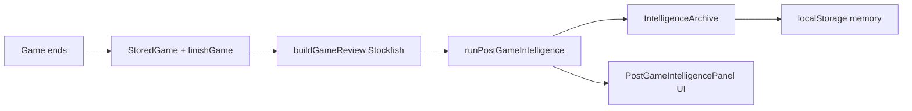

# Post-Game Intelligence Engine

Chimera Chess transforms completed games into **behavioral intelligence** — phenotype shifts, trend signals, and coaching protocols. The design targets a **performance lab** feel (sports science + psychological profiling), not a static stats page.

## Module map

| Module | File | Responsibility |
|--------|------|----------------|
| Game Analysis Service | `services/gameAnalysisService.ts` | Normalize PGN/mistakes/review into `GameAnalysisSnapshot` |
| Phenotype Update Engine | `services/phenotypeUpdateEngine.ts` | EMA phenotype scores + movement narrative |
| Behavioral Pattern Engine | `services/behavioralPatternEngine.ts` | Decision/time/tilt/opening patterns |
| Trend Analysis Service | `services/trendAnalysisService.ts` | Rolling accuracy/ACPL/blunder/win streak |
| Confidence Score Service | `services/confidenceScoreService.ts` | Report + axis confidence from sample depth |
| Coaching Insight Generator | `services/coachingInsightGenerator.ts` | Prioritized prescriptions + tactical cards |
| Report Generator | `services/reportGenerator.ts` | Assemble `PostGameIntelligenceReport` JSON |
| Orchestrator | `engine.ts` | `runPostGameIntelligence()` pipeline |
| Storage | `storage.ts` | Archive on `ChimeraMemory.intelligence` |

Configuration lives in `config.ts` (`INTELLIGENCE_CONFIG`, `PHENOTYPE_AXIS_META`). Tune thresholds without touching service logic.

## Data flow



1. Match persists `StoredGame` via `finishGame` (patterns, learning, CRS).
2. `useGameReview` runs Stockfish review → `GameReviewReport`.
3. `usePostGameIntelligence` calls `runPostGameIntelligence` when review (or game-only heuristic) is ready.
4. Archive appended; memory saved; `CHIMERA_MEMORY_EVENT` refreshes UI.

## Database schema (client persistence)

Stored under `chimera-memory-v3` → `intelligence`:

```typescript
interface IntelligenceArchive {
  version: 1;
  phenotype: Record<IntelligencePhenotypeKey, PhenotypeState>;
  reports: PostGameIntelligenceReport[]; // max 40
  updatedAt: number;
}

interface PhenotypeState {
  score: number;        // 0–100
  momentum: number;     // smoothed delta
  confidence: number;   // 15–88 from games sampled
  lastDelta: number;
  updatedAt: number;
  gamesSampled: number;
  history: { at, gameId, score, delta }[]; // max 24 per axis
}
```

Future server sync: map `reports[].id` → `game_id`, `phenotype` → `player_phenotype_axes` table with `(user_id, axis, score, confidence, updated_at)`.

## API design

### In-process (current)

```typescript
import { runPostGameIntelligence } from "@/intelligence";

const { report, memory, archive } = runPostGameIntelligence({
  game: storedGame,
  memory,
  reviewReport,       // optional; strongly recommended
  mode: "chimera",
  moveTimesMs?: number[],
  sessionTiltScore?: number, // 0–100 from cognition layer
});
```

### REST (production)

| Method | Path | Body | Response |
|--------|------|------|----------|
| `POST` | `/v1/games/:id/intelligence` | `{ pgn, reviewId?, moveTimesMs? }` | `PostGameIntelligenceReport` |
| `GET` | `/v1/players/me/intelligence/latest` | — | latest report |
| `GET` | `/v1/players/me/phenotype` | — | `IntelligenceArchive.phenotype` |
| `GET` | `/v1/players/me/intelligence/trends` | `?window=8` | `PerformanceTrends` |

Run review worker first; intelligence worker consumes review JSON idempotently (`gameId` + `reviewId`).

## Phenotype scoring logic

Per-game **signals** (0–100) blend review phases, mistake rates, radar priors, and outcome. Example — **Tactical sharpness**:

```
signal = 0.5 * radar.tacticalVision
       + 0.3 * (100 - blunderRate * 120)
       + 0.2 * middlegameAccuracy
```

**Update** (avoid one-game swings):

```
rate = baseLearningRate / sqrt(gamesSampled)   // default base 0.22
newScore = EMA(prevScore, signal, rate)
momentum = 0.65 * prevMomentum + 0.35 * delta
confidence = f(gamesSampled)  // 25→55→62→88 thresholds at 0/5/15 games
```

**Tilt tendency** is inverted in UI (lower is better). Signal rises with blunder rate, max CP loss, and `sessionTiltScore`.

Axes: confidence, aggression, positionalDiscipline, tacticalSharpness, timePressureResilience, tiltTendency, riskAppetite, adaptability, endgameDiscipline, openingConfidence.

## Example report JSON

```json
{
  "version": 1,
  "id": "intel-abc123",
  "gameId": "abc123",
  "generatedAt": 1716300000000,
  "headline": "Upward trajectory — stay on the same training rails",
  "summary": "Victory in 12 minutes. 87% accuracy (Strong), 24 ACPL. 3-game win streak. Report confidence: 72% (medium data).",
  "strengths": ["Strong overall accuracy (87%)", "Endgame discipline trending up"],
  "weaknesses": ["1 blunder(s) — largest rating leak"],
  "phenotypeMovement": [
    {
      "key": "tacticalSharpness",
      "label": "Tactical Sharpness",
      "before": 58,
      "after": 61,
      "delta": 3,
      "direction": "up",
      "confidence": 62,
      "interpretation": "Trending up (61/100) — keep reinforcing this habit."
    }
  ],
  "performanceTrends": {
    "accuracy": { "key": "accuracy", "label": "Accuracy", "current": 87, "previousAvg": 82, "delta": 5, "direction": "improving" },
    "acpl": { "key": "acpl", "label": "ACPL", "current": 24, "previousAvg": 31, "delta": -7, "direction": "improving" },
    "blunderRate": { "key": "blunderRate", "label": "Blunder rate", "current": 0.05, "previousAvg": 0.08, "delta": -0.03, "direction": "improving" },
    "winRate": { "key": "winRate", "label": "Win rate (recent)", "current": 60, "previousAvg": 60, "delta": 0, "direction": "stable" },
    "streakLabel": "3-game win streak"
  },
  "recommendedFocus": ["Calculation discipline", "Momentum"],
  "confidence": {
    "overall": 72,
    "phenotype": 58,
    "trends": 48,
    "coaching": 81,
    "sampleGames": 6,
    "dataQuality": "medium"
  },
  "coachingNotes": [
    {
      "id": "blunder-drill",
      "priority": 1,
      "focusArea": "Calculation discipline",
      "prescription": "10 minutes of forced-calculation puzzles before your next rated session.",
      "rationale": "1 blunder(s) cost more than tactics — process beats speed.",
      "timeframe": "next-game"
    }
  ],
  "tacticalObservations": [],
  "behavioralObservations": [],
  "gameAnalysis": { "gameId": "abc123", "accuracy": 87, "acpl": 24 },
  "reviewId": "review-abc123",
  "compareToPrevious": {
    "accuracyDelta": 5,
    "acplDelta": -4,
    "message": "+5% accuracy vs prior report."
  }
}
```

## Production rollout plan

1. **Phase 1 (done)** — Client orchestrator, local archive, UI in `GameReviewPanel`.
2. **Phase 2** — Pass `moveTimesMs` from clock; wire `sessionTiltScore` from `tiltDetector` / cognitive state.
3. **Phase 3** — Call intelligence from `finishGame` with heuristic snapshot when user skips review; re-run when review completes (idempotent on `reviewId`).
4. **Phase 4** — Server workers: PGN ingest → Stockfish review queue → intelligence queue → Postgres.
5. **Phase 5** — Profile “Performance Lab” page: phenotype radar history, report timeline, export JSON/PDF.
6. **Phase 6** — A/B retention metrics on coaching note engagement.

## Integration checklist

- [x] `ChimeraMemory.intelligence` field
- [x] `runPostGameIntelligence` orchestrator
- [x] `usePostGameIntelligence` + `PostGameIntelligencePanel`
- [ ] OnlineMatch: call `finishGame` (not only CRS) so patterns + intelligence sample games align
- [ ] Re-run intelligence when review completes after heuristic-only first pass
- [ ] Dedicated Performance Lab route on player profile
